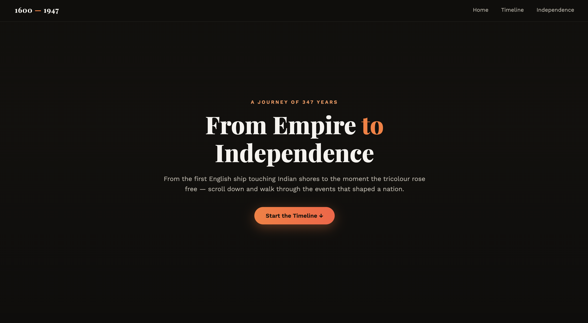
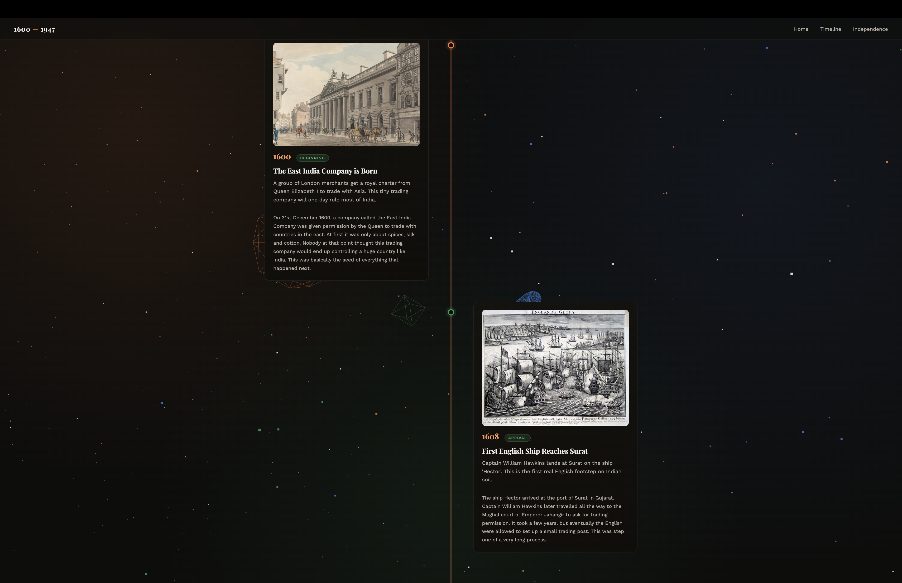

</head>
<body>
<h1>PROJECT TITLE: From Empire To Independence</h1>

<h3>AUTHOR : ATHARV ANAND</h3>
 
<h2>How To Use The Website</h2>

  It's very easy, just open the website and you will see the homepage with a dark, layered background and a 3D star floating behind everything.
   

  

  
 
  scroll down the website and experience all the event cards from 1600 -> 1947 -> 2022 , with a moving 3d animation in the background while scrolling .
   
  
  
  

<h3>Why I made this website ?</h3>

  I made this website because most of the timelines I found online about British rule in India were just plain text , I just wanted to experience a timeline of Indian Independence with a unique style.

<h2>Some cool features</h2>
<ul>
  <li>Timeline of 25 major events from the entry of Britishers in India to the Independence of India . </li>
  <li>Every event card shows its image, tag, short summary and full details.</li>
  <li>Click on any image to zoom it into a full screen view.</li>
  <li>Dark themed site with layered orange, green, blue and white colours in bg, inspired by the Indian flag.</li>
  <li>A 3D background made using 3js built some geometrical rotating shapes and floating particles that will move as you scroll down .</li>

</ul>

<h3> AI use </h3>

I used AI for the content of the timeline and also for the help in the 3d moving animation while scrolling.

<h2>TECH STACK</h2>
 

</body>
</html>
